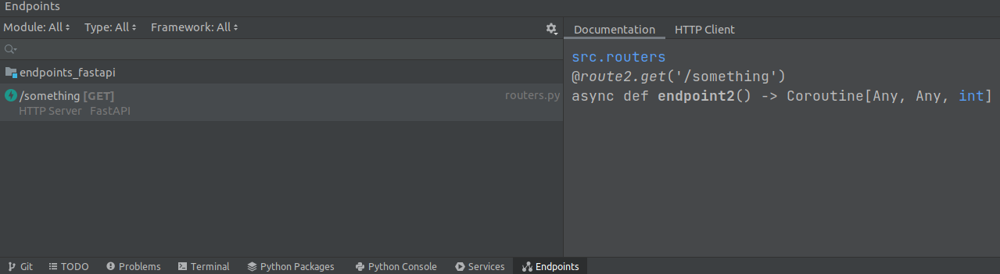

### Run server:
```bash
PYTHONPATH=src python src/main.py
```

### Test endpoints:
```bash
curl 0:8000/route1/something
curl 0:8000/internal/route2/something
```
Logs:
```text
INFO:     127.0.0.1:38978 - "GET /route1/something HTTP/1.1" 200 OK
INFO:     127.0.0.1:38974 - "GET /internal/route2/something HTTP/1.1" 200 OK
```

### Endpoints from PyCharm:
But PyCharm has only one endpoint with path `/something`

